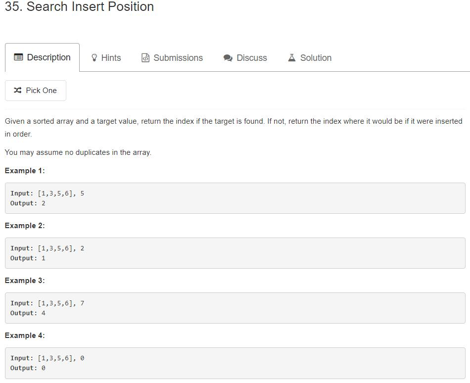
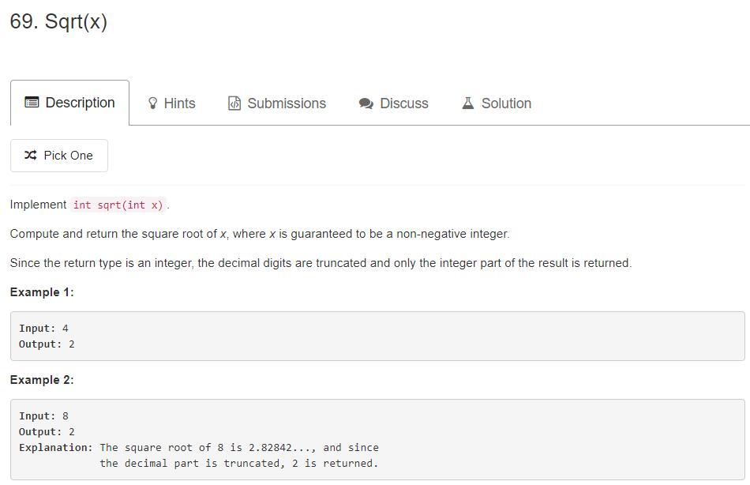

# Binary Search

## 35. Search Insert Position



解题思路

这是一道典型的二分查找的题目，直接使用二分查找模板就可以解决，不过需要注意，当target不在nums中的情况

```cpp
class Solution {
public:
    int searchInsert(vector<int>& nums, int target) { 
        int l = 0, r = nums.size() - 1;
        
        while(l < r) 
        {
            int mid = l + r >> 1;
            if (nums[mid] >= target) r = mid;
            else l = mid + 1;
        }
        if(nums[r] != target) return ++r;
        else return r;
    }
};
```

## 69. Sqrt(x)



**解题思路：**

直接使用二分模板就可以解决, 但是需要注意这里是向下取整，也就是要找到从左边接近这个目标值的数

```cpp
class Solution {
public:
    int mySqrt(int x) {
        long l = 0, r = x;
        while(l < r)
        {
            long long mid = l + x + 1 >> 1;
            if(mid * mid <= x) l = mid;
            else r = mid - 1;
        }
        
        return l;
    }
};
// 使用下面这个模板会出错，下面这个模板是向上取整
class Solution {
public:
    int mySqrt(int x) {
        long l = 0, r = x;
        while(l < r)
        {
            long long mid = l + r>> 1;
            if(mid * mid <= x) r = mid;
            else l = mid - 1;
        }
        
        return r;
    }
};
```

## 278.  First Bad Version


解题思路：

这道题还是使用简单的二分模板就可以解决，这道题本质上是求一个升序数组的某个条件的左边界，然后使用的check函数是题目已经给出的。

```cpp
// Forward declaration of isBadVersion API.
bool isBadVersion(int version);

class Solution {
public:
    int firstBadVersion(int n) {
        int l = 1, r = n;
        while(l < r)
        {
            int mid = l + (r - l) / 2;
            if(isBadVersion(mid)) r = mid;
            else l = mid + 1;
        }
        
        return r;
    }
};
```