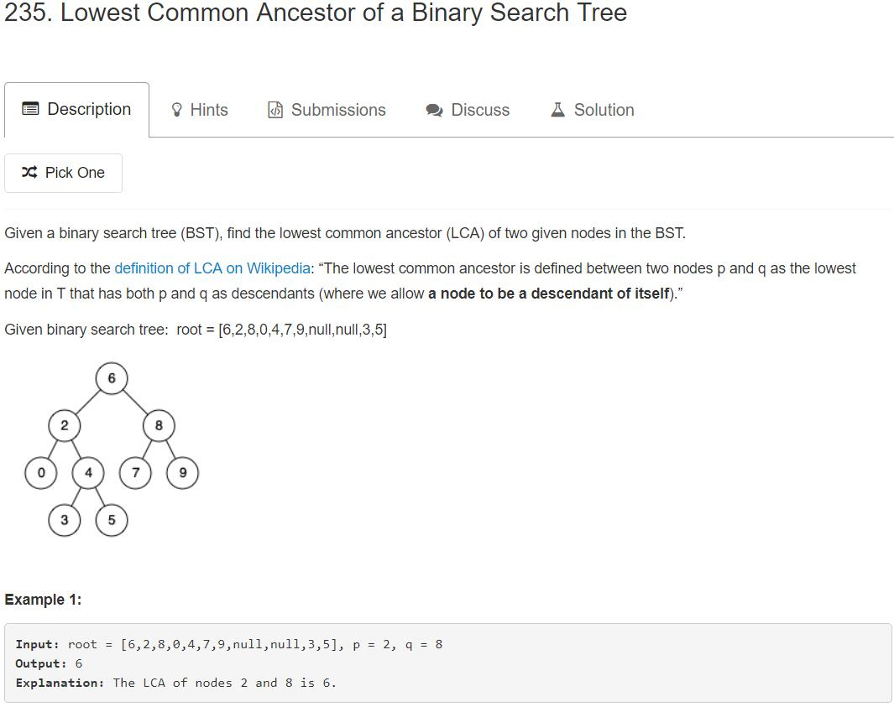

# Tree

## 100. Same Tree


解题思路：

判断两棵树是不是相同的，需要满足的是树的每一个节点以及节点上的值都相等，主要需要注意一下特殊情况，关于树的题都是使用递归来做的，这道题的递归出口是，只要有一个树上的节点为空，就比较另一个节点是不是也为空，如果是的话，说明是相同的，否则直接返回false。在递归的过程中，由于先判断了两个节点非空，所以接下来需要判断两个节点的上的值是否相等，如果相等的话继续递归的判读这两课数的左右子树是否也相同。

```cpp
/**
 * Definition for a binary tree node.
 * struct TreeNode {
 *     int val;
 *     TreeNode *left;
 *     TreeNode *right;
 *     TreeNode(int x) : val(x), left(NULL), right(NULL) {}
 * };
 */
class Solution {
public:
    bool isSameTree(TreeNode* p, TreeNode* q) {
        if(!p || !q) return !p && !q;
        else return p->val == q->val && isSameTree(p->left, q->left)
                    && isSameTree(p->right, q->right);
    }
};
```

## 101. Symmetric Tree


解题思路：

首先需要理解对称树的概念，与100题判断是否是一颗相同的树一样的思路，只不过在判断完两个节点非空之后，需要判断的是第一棵树的做孩子应该等于右边的孩子节点（上面那道题就是左边还等于左边，右边还等于右边）

```cpp
/**
 * Definition for a binary tree node.
 * struct TreeNode {
 *     int val;
 *     TreeNode *left;
 *     TreeNode *right;
 *     TreeNode(int x) : val(x), left(NULL), right(NULL) {}
 * };
 */
class Solution {
public:
    bool isSymmetric(TreeNode* root) {
        return check(root, root);
    }
    bool check(TreeNode* p, TreeNode* q)
    {
        if (!p || !q) return !p && !q;
        else return p->val == q->val && check(p->left, q->right) && check(p->right, q->left);
    }
};
```

## 104. Maximum Depth of Binary Tree


解题思路：

求解树的最大深度，使用递归的思想就是求的最大深度的子树的深度加1 ，就是整个树的最大深度。

```cpp
/**
 * Definition for a binary tree node.
 * struct TreeNode {
 *     int val;
 *     TreeNode *left;
 *     TreeNode *right;
 *     TreeNode(int x) : val(x), left(NULL), right(NULL) {}
 * };
 */
class Solution {
public:
    int maxDepth(TreeNode* root) {
        if (!root) return 0;
        else return max(maxDepth(root->left), maxDepth(root->right)) + 1;
    }
};
```

## 144. Binary Tree Preorder Traversal


**解题思路：**

使用递归的方法：理解二叉树的前序遍历

使用非递归的方法：用栈模拟递归。首先需要清晰的明白树的前序遍历是怎么回事，然后再用栈模拟递归

```cpp
/**
 * Definition for a binary tree node.
 * struct TreeNode {
 *     int val;
 *     TreeNode *left;
 *     TreeNode *right;
 *     TreeNode(int x) : val(x), left(NULL), right(NULL) {}
 * };
 */
class Solution {
public:
    vector<int> preorderTraversal(TreeNode* root) {
        vector<int> res;
        preorderTraversal(root, res);
        return res;
    }
    
    void preorderTraversal(TreeNode* root,  vector<int>& res)
    {
        if (!root) return;
        
        res.push_back(root->val);
        preorderTraversal(root->left, res);
        preorderTraversal(root->right, res);
    }
};
```

```cpp
/**
 * Definition for a binary tree node.
 * struct TreeNode {
 *     int val;
 *     TreeNode *left;
 *     TreeNode *right;
 *     TreeNode(int x) : val(x), left(NULL), right(NULL) {}
 * };
 */
class Solution {
public:
    vector<int> preorderTraversal(TreeNode* root) {
        // 用栈模拟递归
        stack<TreeNode*> st;
        vector<int> res;
        
        if(root) st.push(root);
        while(!st.empty())
        {
            auto tmp = st.top();
            res.push_back(tmp->val), st.pop();
            if (tmp->right) st.push(tmp->right);
            if (tmp->left) st.push(tmp->left);
        }
        
        return res;
    }
};
```

## 94. Binary Tree Inorder Traversal


**解题思路：**

使用递归的方法：理解二叉树的中序遍历

使用非递归的方法：使用栈模拟递归，明确树的中序遍历之后再使用栈去模拟递归

```cpp
/**
 * Definition for a binary tree node.
 * struct TreeNode {
 *     int val;
 *     TreeNode *left;
 *     TreeNode *right;
 *     TreeNode(int x) : val(x), left(NULL), right(NULL) {}
 * };
 */
class Solution {
public:
    vector<int> inorderTraversal(TreeNode* root) {
        vector<int> res;
        inorderTraversal(root, res);
        return res;
    }
    void inorderTraversal(TreeNode* root, vector<int>& res)
    {
        if (!root) return;
        inorderTraversal(root->left, res);
        res.push_back(root->val);
        inorderTraversal(root->right, res);
    }
    
};
```

```cpp
/**
 * Definition for a binary tree node.
 * struct TreeNode {
 *     int val;
 *     TreeNode *left;
 *     TreeNode *right;
 *     TreeNode(int x) : val(x), left(NULL), right(NULL) {}
 * };
 */
class Solution {
public:
    vector<int> inorderTraversal(TreeNode* root) {
        stack<TreeNode*> st;
        vector<int> res;
        
        auto curr = root;
        //只有当前节点为空，并且栈也为空才算遍历完成（因为存在只有栈为空或者只有当前节点为空的时候）
        while(curr || !st.empty()) 
        {
            while(curr)
            {
                st.push(curr);
                curr = curr->left;
            }

            auto tmp = st.top();
            st.pop();
            res.push_back(tmp->val);
            curr = tmp->right;
        }
        
        return res;
    } 
};
```

## 145. Binary Tree Posterorder Traversal


**解题思路：**

使用递归的方法：理解二叉树的后序遍历

使用非递归的方法：后面在补充

```cpp
/**
 * Definition for a binary tree node.
 * struct TreeNode {
 *     int val;
 *     TreeNode *left;
 *     TreeNode *right;
 *     TreeNode(int x) : val(x), left(NULL), right(NULL) {}
 * };
 */
class Solution {
public:
    vector<int> postorderTraversal(TreeNode* root) {
        vector<int> res;
        postorderTraversal(root, res);
        return res;
    }
    
    void postorderTraversal(TreeNode* root, vector<int>& res)
    {
        if (!root) return; 
        postorderTraversal(root->left, res);
        postorderTraversal(root->right, res);
        res.push_back(root->val);
    }
};
```

## 102. Binary Tree Level Order Traversal


解题思路：

这题是二叉树的层次遍历，其实有两种方法都可以实现二叉树的层次遍历，BFS（广度优先搜索）， DFS(深度优先搜索), 使用深度优先搜索是一种递归的写法，代码看起来更加的简洁。

```cpp
/**
 * Definition for a binary tree node.
 * struct TreeNode {
 *     int val;
 *     TreeNode *left;
 *     TreeNode *right;
 *     TreeNode(int x) : val(x), left(NULL), right(NULL) {}
 * };
 */
class Solution {
public:
    vector<vector<int>> levelOrder(TreeNode* root) {
        // BFS
        /*
            二叉树的层次遍历的核心思想就是使用两个栈，一个是存储当前需要遍历元素的栈，另一个是存储下一次需要遍历元素的栈
            下一次需要遍历的元素是在遍历当前栈的同时产生的，也就是遍历当前栈中的元素的时候，都需要判断一下当前遍历的节点
            是否有孩子节点，如果有孩子节点的话以先左节点后有节点的顺序添加到存储下一次遍历的栈中
        */
        vector<vector<int>> res;
        vector<TreeNode*> curr, next;
        
        if (root) curr.push_back(root);
        while(!curr.empty())
        {
            // 先添加一行
            res.push_back({});
            for(auto node : curr)
            {
                // 每次都是在最后一行进行添加元素
                res.back().push_back(node->val);
                // 为了保证访问的顺序，应该先把左边元素添加到next中
                if (node->left) next.push_back(node->left);
                if (node->right) next.push_back(node->right);
            }
            
            // 访问完当前的curr中的所有元素之后，应该将curr中的元素与next进行交换，然后让next置空
            swap(curr, next);
            next.clear();
        }
        return res;
    }
};
```

```cpp
/**
 * Definition for a binary tree node.
 * struct TreeNode {
 *     int val;
 *     TreeNode *left;
 *     TreeNode *right;
 *     TreeNode(int x) : val(x), left(NULL), right(NULL) {}
 * };
 */
class Solution {
public:
    vector<vector<int>> levelOrder(TreeNode* root) {
        /*
            基于DFS的二叉树层次遍历，核心的思想就是动态并且是纵向的将每一层的元素添加到相应的层后面
        */
        vector<vector<int>> res;
        DFS(root, 0, res);
        
        return res;
    }
    
    void DFS(TreeNode* root, int depth, vector<vector<int>>& res)
    {
        if(!root) return;
        if(res.size() <= depth) res.push_back({});
        res[depth].push_back(root->val);
        DFS(root->left, depth + 1, res);
        DFS(root->right, depth + 1, res);
    }
};
```

## 112. Path Sum


**解题思路：**

这道题是求解一个从根节点到叶子节点的某一条路径上的所有节点的和加起来为某个数。可以使用递归的方法，每次在访问了一个节点之后将sum减去这个节点的值作为新的sum，然后分别递归左子树和右子树。当且仅当访问的叶子节点（左右子树都为空）时sum的值等于当前节点的值说明存在一个path满足题意。

```cpp
/**
 * Definition for a binary tree node.
 * struct TreeNode {
 *     int val;
 *     TreeNode *left;
 *     TreeNode *right;
 *     TreeNode(int x) : val(x), left(NULL), right(NULL) {}
 * };
 */
class Solution {
public:
    bool hasPathSum(TreeNode* root, int sum) {
        if(!root) return false;
        if(!root->left && !root->right) return root->val == sum;
        int new_sum = sum - root->val;
        
        return hasPathSum(root->left, new_sum) || hasPathSum(root->right, new_sum);
    }
};
```

## 226. Invert Binary Tree


解题思路：

逆转二叉树，从题意可以看出就是将二叉树的左右子树进行反转。只需要使用递归的方法将左右子节点分别进行逆转就可以。

```cpp
/**
 * Definition for a binary tree node.
 * struct TreeNode {
 *     int val;
 *     TreeNode *left;
 *     TreeNode *right;
 *     TreeNode(int x) : val(x), left(NULL), right(NULL) {}
 * };
 */
class Solution {
public:
    TreeNode* invertTree(TreeNode* root) {
        if(!root) return 0;
        swap(root->left, root->right);
        invertTree(root->left), invertTree(root->right);
        return root;
    }
};
```

## 111. Minimun Depth of Binary Tree


解题思路：

首先需要理解什么是叶子节点，叶子节点指的是，左右孩子都为空节点。这道题与求解树的最大深度不一样，求解树的最大深度，每次遍历的时候只要左右孩子有一个不为空就继续迭代，并且每次迭代深度加1 ，但是这里求解树的最小深度迭代的停止条件是左右孩子节点同时为空。但是为了编程方便，直接求左子树和右子树的最小深度，

```cpp
/**
 * Definition for a binary tree node.
 * struct TreeNode {
 *     int val;
 *     TreeNode *left;
 *     TreeNode *right;
 *     TreeNode(int x) : val(x), left(NULL), right(NULL) {}
 * };
 */
class Solution {
public:
    int minDepth(TreeNode* root) {
        if (!root) return 0;
        int left = minDepth(root->left);
        int right = minDepth(root->right);
        // 左右子树有一个子树深度为0，此时应该返回更深的那一个分支
        // 左右子树的深度同时为零，说明此时到达了叶子节点应该返回较小的那一边
        if (left == 0 || right == 0)
            return 1 + max(left, right);
        else
            return 1 + min(left, right);
    }
};
```


## 235. Lowest common Ancestor of a Binary Search Tree



解题思路：

首先需要知道什么是二叉搜索树，二叉搜索树又叫做二叉排序树，具体的特征就是，根节点的左子树上的所有元素都小于等于根节点上的值，右子树上的所有节点的值都大于等于根节点上的值。

这道题是随机给定一个二叉搜索树的两个子节点，求解这两个子节点的最近公共祖先，首先对于根节点来说，肯定是可能的最近公共祖先，然后判断根节点上的值是否大于给定两个子节点的值，是的话说明最近公共祖先在当前根节点的左子树中，反之在当前根节点的右子树中。

```cpp
/**
 * Definition for a binary tree node.
 * struct TreeNode {
 *     int val;
 *     TreeNode *left;
 *     TreeNode *right;
 *     TreeNode(int x) : val(x), left(NULL), right(NULL) {}
 * };
 */
class Solution {
public:
    TreeNode* lowestCommonAncestor(TreeNode* root, TreeNode* p, TreeNode* q) {
        TreeNode* curr = root;
        while(1)
        {
            // 两个节点同时在左子树上
            if (p->val < curr->val && q->val < curr->val) 
                curr = curr->left;
            // 两个节点同时在右子树上
            else if (p->val > curr->val && q->val > curr->val)
                curr = curr->right;
            // 如果不是同时在左子树上或者同时在右子树上，说明在当前根节点的两边，所以当前节点就是最近公共祖先
            else break;
        }
        
        return curr;
    }
};
```

......